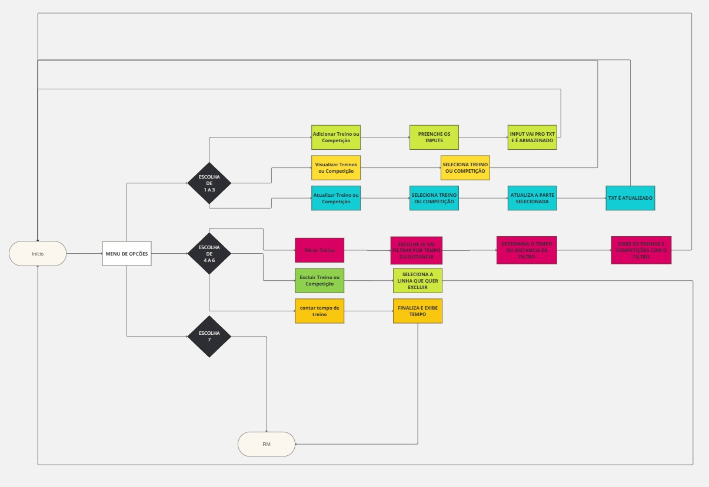

# CRUD DE FUNDAMENTOS DE PROGRAMAÇÃO


Nesse projeto foi desenvolvido o CRUD onde foram feitas as etapas de armazenamento de treinos e competições de um determinado atleta, podendo criar novos trenos, atalizar informações sobre eles e também deletalos. Além de tudo isso, foi implementada uma função de tempo para que possa cronometrar seus treinos.


## 🚀 C.R.U.D - CREATE | READ | UPDATE | DELETE


USAMOS DE *VETORES* PARA ARMAZENAR AS INFORMAÇOES, ORGANIZA-LAS E IMLEMENTALAS NO **'ARQUIVO.TXT"**


Consulte **[Implantação](#-implanta%C3%A7%C3%A3o)** para saber como implantar o projeto.


### 📋 Funcionamento


```python

Menu:
1. Adicionar Treino ou Competição
2. Visualizar Treinos ou Competição
3. Atualizar Treino ou Competição
4. filtrar Treino
5. Excluir Treino ou Competição
6. contar tempo de treino
7. Sair

```


### 🔧 manutenção de treinos:


após adicionar um treino, ele vai ser separado e implementado no arquivo'.txt', dessa forma:


```txt
treino;11/11/11;11.0;11.0;climafrio
competição;11/11/11;11.0;11.0;climaquente
```


quando ele é solicitado para sustituir/deletar, aparece no terminal dessa forma:


```python
1.treino;11/11/11;11.0;11.0;climafrio
2.competição;11/11/11;11.0;11.0;climaquente


##assim você seleciona o arquivo que quer alterar colocando sua numeração no input do terminal
```


## ⚙️ COM OS TREINOS ADICIOADOS


Com os treinos adicioados, ten-se as opções de visualização e também de substituir datasets


### 🔩 Substituindo as datasets


Os seguinte código serve para modificar os itens do arquivo individualmente, dessa forma, coseguindo alterar no formato correto, caso erre o formato, será exibido **ERRO DE TIPAGEM**:.


```python
try:
        index = int(input("Qual o dataset a modificar?: ")) - 1


        arquivo = arquivoHandler("treinos.txt", "r")
        data = arquivo.readlines()


        arquivo.close()


        data[index] = verificaTreino()


        arquivo = arquivoHandler("treinos.txt", "w")


        for i in data:
            arquivo.write(i)
       
        print("Dataset modificado com sucesso!")
        arquivo.close()


    except ValueError:
        print("Erro de tipagem")
    except IndexError:
        print("Dataset inexistente")
```


## ☮️ FILTRANDO. . . .


### AGORA O TEMPO ESCOLHIDO VAI FILTRAR OS TREINOS DO USUÁRIO...


### 🔩 Substituindo as datasets


ao ativar essa funcionalidade foi criado um submenu de objetivos

```python

#OUTPUT

try:
        with open(nome_arquivo, 'r') as arquivo:
            linhas = arquivo.readlines()
            for linha in linhas:
                partes = linha.strip().split(';')
                if len(partes) == 6: 
                    ..................

#   terminal:                 ------------------------------------------------------------

Filtrar Treinos
1. Filtrar por Distância
2. Filtrar por Tempo
Escolha uma opção (1 ou 2): 2
Digite o tempo máximo desejado (minutos): 60


```
## saída : .
```Python

Treinos com tempo de 60.0 minutos:
Tipo: Treino, Data: 20/10/2020, Distância: 15.0 km, Tempo: 60.0 min, Localização: jaqueira, Clima: sol

````
a partir disso ten-se um treino filtrado com a escolha do usuário, onde poderia se ter filtrado por distancia ou por tempo

## saída : .


## 🗣️ COM OS TREINOS ADICIOADOS . . . .


### agora seguem as funcionalidades 5 e 6...


### 🔩 Substituindo as datasets


ao ativar essa funcionalidade foi criado um submenu de objetivos

```python

Menu:
1. Exibir objetivos
2. Adicionar Objetivo
3. Atualizar Objetivo
4. Deletar Objetivo
5. Voltar ao menu principal


```
a partir disso ten-se um treino sugerido:

## saída : .

```python

Seu treino será: 550.0 m em 54.0 segundos

```

## 🕑 FUNCIONALIDADE EXTRA. . . .

A FUNCIONALIDADE EXTRA ESCOLHIDA FOI UM CONTADOR DE TEMPO PARA "SEUS" TREINOS


DESSA FORMA
```python

6. contar tempo de treino

# AO ESCOLHER ESSA OPÇÃO "LÁ NO PRIMEIRO MENU", INICIARÁ UM CONTADOR

```
a partir disso, APÓS o proximo input:

## saída : .

```python

Digite qualquer coisa para parar o contador:
||

seu tempo foi de 99 segundos

```

## 📦 Implantação


A IMPLEMENTAÇÃO FOI VIA REPOSITÓRIO, NESSE GIT HUB


## 🛠️ Construído com


os system

python

biblioteca time(na funcionalidade extra)


## 🖇️ Colaborando


**Leonardo Gutzeit Borgmann Matos**

**Matheus Henrique Araujo**

**JOÃO LUCAS**

**Guilherme Santa Cruz Vieira Hecksher**.

**LUIS FELIPE**


......................................................................


# 💻 FLUXOGRAMA:


 